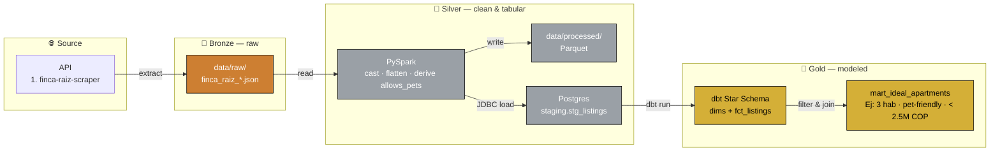
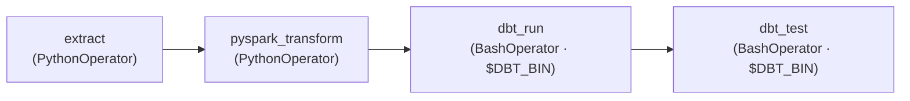
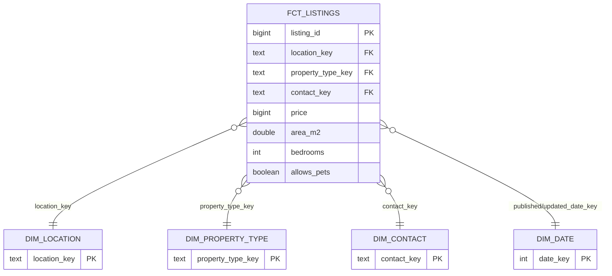

# MADI — Medellín Apartment Data Integration
> Pipeline de datos de end-to-end. Automatiza la búsqueda de un apartamento muy específico en **Medellín, Colombia**. Ejecutándose totalmente en una máquina local.

---

## 📌 Overview

**MADI** convierte la búsqueda manual en una automatización. Extrae publicaciones de plataformas como Finca Raíz vía **API** (Apify), los procesa mediante una **arquitectura Medallion**, los modela en un **Esquema Estrella** con **dbt**, y produce una única tabla analítica — `mart_ideal_apartments` — que contiene sólo los anuncios que cumplen los criterios objetivos, ordenados por precio (los más baratos primero).

Orquestado por **Airflow**, dentro de **Docker**. Data Warehouse, Orquestador, Spark y dbt se levanta con un único comando.

---

> **Decisiones de soporte:** dbt vive en un **virtualenv aislado** (`/opt/dbt_venv`) para evitar conflictos de dependencias con Airflow; el **driver JDBC de Postgres** está incluido en la imagen para que la escritura Spark→Postgres funcione offline; el **contenedor PostgreSQL aloja dos bases de datos** (metadatos de Airflow + el warehouse `madi_dwh`) para mantener la huella pequeña; y **todos los parámetros y secretos están centralizados** en `config/config.yaml` + `.env`.

---

## 📊 Arquitectura (Medallion)



**Orquestación** — un único DAG de Airflow (`pipeline/` - `madi_finca_raiz_pipeline`) ejecuta las etapas estrictamente en secuencia:



La ruta del archivo raw es pasada de `extract` a `pyspark_transform` vía XCom*


### ⭐ Modelo dimensional (Gold)



---

## 📁 Estructura del proyecto

```
MADI/
├── config/
│   └── config.yaml             #   Filtros, conexiones, inputs...
├── data/
│   ├── raw/                    #   Bronze — JSON
│   └── processed/              #   Silver — Parquet
├── docker/
│   └── postgres/
│       └── init/               #   Crea madi_dwh + schemas
├── etl/
│   ├── extract/                #   Ingesta (API)
│   ├── transform/              #   Limpieza (PySpark)
├── pipelines/
│   └── finca_raiz_pipeline.py  #   DAG
├── src/                        #   Lógica compartida y reutilizable (sin duplicar)
│   ├── utils/                  #   config_loader · logger · db · spark · apify_extractor
│   ├── data/                   #   features.py (regex allows_pets — fuente única)
│   └── validation/             #   raw_schema.py (chequeos de sanidad del payload Bronze)
├── Dockerfile                  #   Imagen (Java + PySpark + dbt + JDBC + pytest)
├── docker-compose.yml          #   Postgres + Airflow (init/webserver/scheduler)
├── requirements*.txt           #   dependencias runtime / dbt / dev
└── .env.example                #   plantilla para secretos

Working On
-----------------------------------------------------------------------------------------------
├── dbt/                        #   Gold — dbt (Esquema Estrella + mart)
│   ├── dbt_project.yml         #   Enrutamiento de esquemas
│   ├── profiles.yml            #   Conexión vía variables de entorno
│   ├── macros/                 #   generate_schema_name, null-safe surrogate_key
│   ├── models/
│   │   ├── staging/            #   stg_finca_raiz__listings
│   │   └── marts/
│   │       ├── dimensions/     #   dim_location · dim_property_type · dim_contact · dim_date
│   │       ├── facts/          #   fct_listings
│   │       └── analytics/      #   mart_ideal_apartments  ← Tabla Final
│   └── tests/                  #   Check del mart (cumple el filtro)
├── tests/                      #  suite pytest (+ fixtures/)
└── pytest.ini
-----------------------------------------------------------------------------------------------
```

---

## Stack


## Resumen
| Etapa | Capa | Tech | Salida |
|-------|-------|------|--------|
| Extract | Bronze | Apify | `data/raw/finca_raiz_*.json` |
| Transform | Silver | PySpark | `data/processed/*.parquet` + `staging.stg_listings` |
| Model | Gold | dbt | `marts.*` dims/facts + `mart_ideal_apartments` |
| Test | — | — | — |